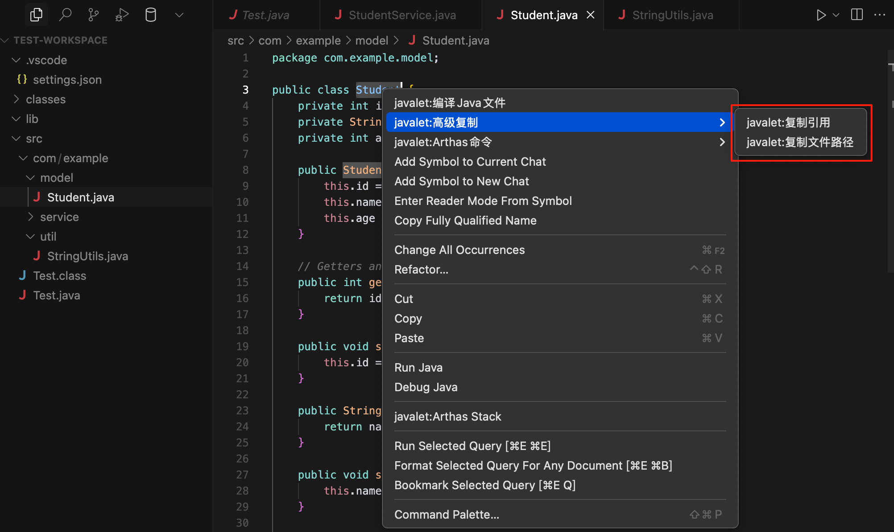
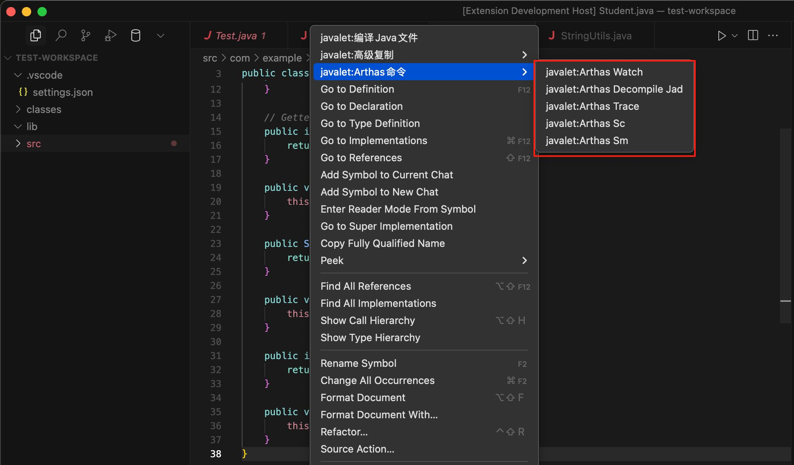

# Handy Javalet

便捷的Java开发小工具集合，提供了一系列实用的Java开发辅助功能。

## 功能演示

## 功能特性

### 1. 基础功能
- 编译Java文件：快速编译当前Java文件
- 显示文档：查看插件使用说明

### 2. 高级复制功能
- 复制引用：复制类或方法的完整引用（例如：com.example.MyClass#myMethod）
- 复制文件路径：复制类或方法的文件路径（例如：com/example/MyClass#myMethod）

### 3. Arthas 命令生成
支持以下Arthas命令的快速生成：
- Watch：观察方法的入参、返回值和异常信息
- Jad：反编译指定的类
- Trace：追踪方法调用路径
- Stack：查看方法调用堆栈
- Sc：查看类的详细信息
- Sm：查看类的方法信息

## 使用方法

1. 在Java文件中右键点击，可以看到以下菜单项：
   - javalet:编译Java文件
   - javalet:高级复制
   - javalet:Arthas命令

2. 选择需要的功能：
   - 编译：直接编译当前Java文件
   - 复制：选择要复制的引用或路径格式
   - Arthas：选择要生成的Arthas命令，命令会自动复制到剪贴板

## 注意事项

- 部分命令（如方法相关的命令）需要将光标置于方法内才能使用
- 编译功能需要本地已安装JDK
- Arthas命令需要目标环境已安装Arthas

## 贡献

欢迎提交Issue和Pull Request！

## 许可证

MIT 